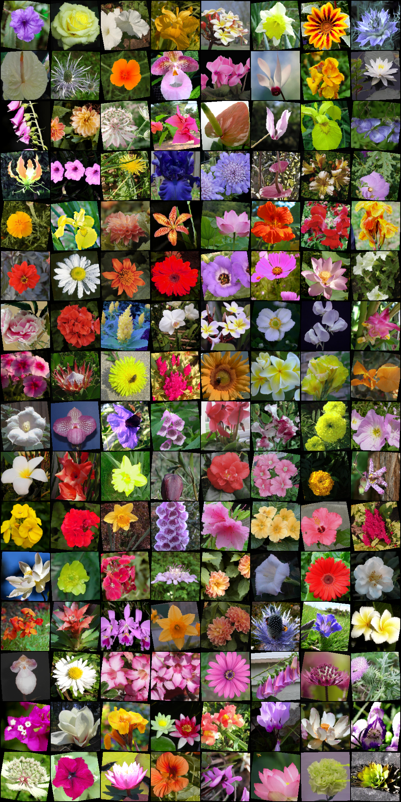
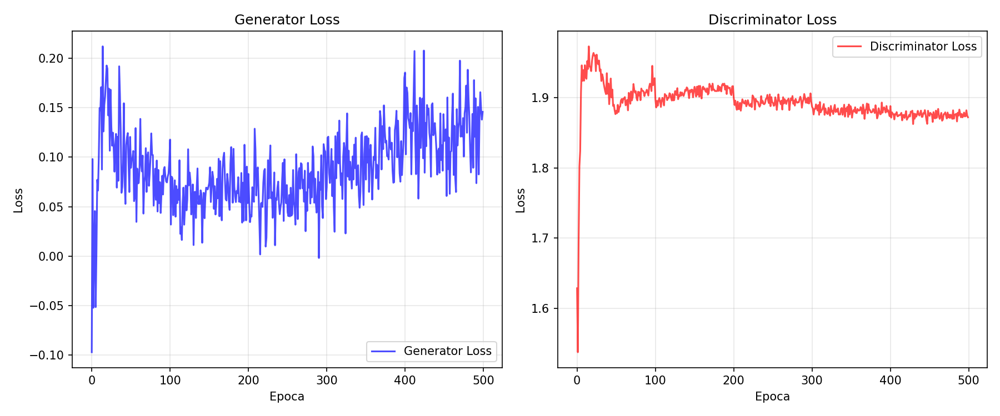
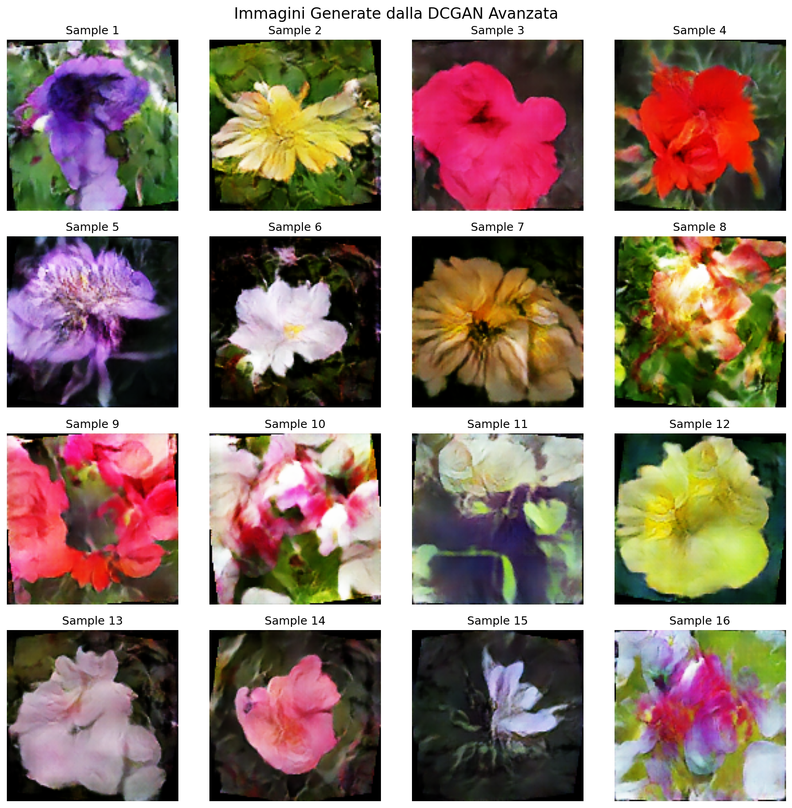
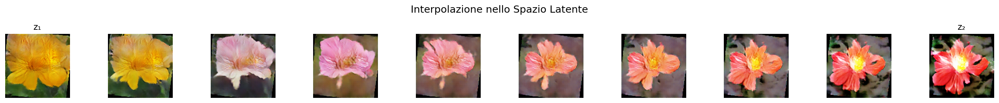

# Deep Convolutional GAN

Una DCGAN avanzata per la generazione di immagini di fiori, implementata con tecniche state-of-the-art per migliorare la stabilità del training e la qualità delle immagini generate.

## Panoramica del Progetto

Questo progetto implementa una **Deep Convolutional Generative Adversarial Network (DCGAN)** addestrata sul dataset **Oxford Flowers 102** per generare immagini realistiche di fiori a risoluzione 128x128.

A differenza di una DCGAN vanilla, questa implementazione integra diverse tecniche avanzate che risolvono i problemi comuni delle GAN:
- mode collapse
- training instabile
- overfitting del Discriminator

## Dataset

Il modello è stato addestrato su **Oxford Flowers 102**, un dataset contenente 8.189 immagini di fiori appartenenti a 102 categorie diverse. Per massimizzare i dati disponibili, sono stati combinati tutti gli split (train, validation e test).

### Immagini Reali dal Dataset

## Architettura

### Generator

Il Generator trasforma un vettore di rumore latente (128 dimensioni) in un'immagine RGB 128x128 attraverso una serie di upsampling progressivi:

- **Transposed Convolutions** per l'upsampling learnable
- **Self-Attention Layer** a risoluzione 32x32 per catturare dipendenze spaziali a lungo raggio
- **Residual Block** per migliorare il flusso dei gradienti
- **Batch Normalization** per stabilizzare il training
- **Tanh** come attivazione finale per output in [-1, 1]

### Discriminator

Il Discriminator è un classificatore binario che analizza le immagini attraverso downsampling progressivo:

- **Strided Convolutions** invece di pooling (downsampling learnable)
- **Spectral Normalization** su tutti i layer per controllare la costante di Lipschitz
- **Self-Attention Layer** a risoluzione 32x32
- **LeakyReLU** per evitare il problema dei "dying neurons"
- Output senza Sigmoid (compatibile con Hinge Loss)

## Tecniche di Stabilizzazione

### 1. Spectral Normalization

Normalizza i pesi di ogni layer del Discriminator dividendo per il valore singolare massimo. Questo controlla la costante di Lipschitz della rete, prevenendo che il Discriminator diventi troppo potente e causi mode collapse.

### 2. Hinge Loss

Alternativa più stabile alla Binary Cross Entropy. Introduce margini (+1 per immagini reali, -1 per fake) che impediscono al Discriminator di diventare troppo sicuro, mantenendo gradienti utili per il Generator.

### 3. R1 Gradient Penalty

Penalizza i gradienti del Discriminator sulle immagini reali, impedendo la creazione di superfici di decisione troppo ripide. Applicata ogni 16 batch per efficienza computazionale (lazy regularization).

### 4. DiffAugment (Differentiable Augmentation)

Applica augmentation differenziabile (variazioni di colore, traslazione, cutout) sia alle immagini reali che fake. Questo previene l'overfitting del Discriminator su dataset di dimensioni limitate, costringendolo a imparare feature più generalizzabili.

### 5. Instance Noise

Aggiunge rumore gaussiano alle immagini durante il training, con intensità decrescente nel tempo. Nelle prime epoche, questo impedisce al Discriminator di distinguere troppo facilmente real da fake, dando tempo al Generator di imparare.

### 6. TTUR (Two-Timescale Update Rule)

Learning rate diversi per Generator (0.0001) e Discriminator (0.0002). Il Discriminator necessita di un learning rate più alto per adattarsi rapidamente ai continui miglioramenti del Generator.

### 7. Mixed Precision Training (AMP)

Utilizza float16 dove possibile per accelerare il training del 30-40% su GPU con Tensor Cores, senza perdita di qualità grazie al gradient scaling dinamico.

## Risultati

### Curve di Loss

Le curve di loss mostrano un training (500 epoche) stabile e bilanciato:

- **Generator Loss**: oscilla nel range [-0.1, 0.2] senza crescere indefinitamente
- **Discriminator Loss**: si stabilizza attorno a 1.87-1.90 (leggermente alto per effetto della R1 penalty)
- **Equilibrio dinamico**: entrambe le loss rimangono bounded, indicando assenza di mode collapse e divergenza

### Immagini Generate

Il Generator produce immagini di fiori con:
- Colori vividi e naturali
- Struttura dei petali riconoscibile
- Varietà nelle forme e nei colori (assenza di mode collapse)
- Sfondi coerenti con il soggetto

### Interpolazione nello Spazio Latente

L'interpolazione lineare tra due punti dello spazio latente dimostra che il modello ha appreso una rappresentazione continua e ben strutturata:

- **Transizioni smooth** di colore (giallo → arancione → rosa → rosso)
- **Trasformazioni graduali** della forma dei petali
- **Tutte le immagini intermedie sono fiori riconoscibili**
- **Nessun artefatto** o immagine "rotta" durante la transizione

## Specifiche Tecniche

| Parametro | Valore |
|-----------|--------|
| Risoluzione immagini | 128 x 128 |
| Dimensione spazio latente | 128 |
| Batch size | 128 |
| Epoche | 500 |
| Learning rate Generator | 0.0001 |
| Learning rate Discriminator | 0.0002 |
| Ottimizzatore | Adam (β₁=0, β₂=0.9) |
| R1 gamma | 10.0 |
| R1 interval | 16 batch |
| DiffAugment policy | color, translation, cutout |

## Riferimenti

- Radford A., Metz L. & Chintala S. (2015). *[Unsupervised Representation Learning with Deep Convolutional Generative Adversarial Networks](https://arxiv.org/abs/1511.06434)*
- Zhang H., Goodfellow I., Metaxas D. & Odena A. (2018). *[Self-Attention Generative Adversarial Networks](https://arxiv.org/abs/1805.08318)*
- Miyato T., Kataoka T., Koyama M. & Yoshida Y. (2018). *[Spectral Normalization for Generative Adversarial Networks](https://arxiv.org/abs/1802.05957)*
- Mescheder L., Geiger A. & Nowozin S. (2018). *[Which Training Methods for GANs do actually Converge?](https://arxiv.org/abs/1801.04406)*
- Zhao S., Liu Z., Lin J., Zhu J. & Han S. (2020). *[Differentiable Augmentation for Data-Efficient GAN Training](https://arxiv.org/abs/2006.10738)*
- Heusel M., Ramsauer H., Unterthiner T., Nessler B. & Hochreiter S. (2017). *[GANs Trained by a Two Time-Scale Update Rule Converge to a Local Nash Equilibrium](https://arxiv.org/abs/1706.08500)*

## Licenza

Questo progetto è stato sviluppato a scopo didattico come parte del corso di Generative AI del Master in AI Engineering di [ProfessionAI](https://github.com/ProfAI)
